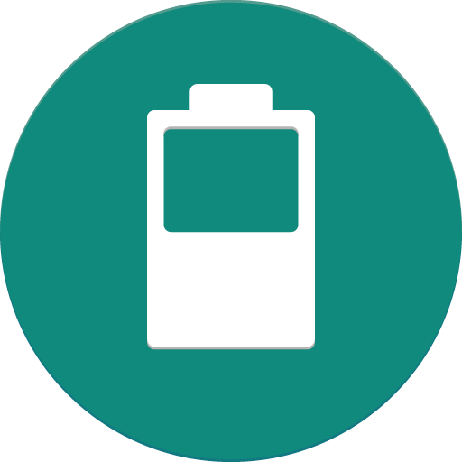

 BatteryNotification
=================
[](https://opensource.org/licenses/)[]()

Battery stats at a glance!

[](https://f-droid.org/packages/com.ominous.batterynotification/)
[](https://play.google.com/store/apps/details?id=com.ominous.batterynotification)

Description
---

Always Free (No IAPs or Ads) and Always Open Source

Persistent Notification Includes:
* Battery Level (Including Color Indicator for Android 5.0+)
* Battery Temperature (in Fahrenheit or Celcius)
* Charging State
* Battery Health
* Charging/Discharging Amperage (for Android 5.0+)
* (Root/ADB Only for Android 5.0+) Time Remaining Until Fully Charged or Discharged

Required Permissions:
* **android.permission.RECEIVE_BOOT_COMPLETED** - Used to restart the notification after rebooting the device

Optional Permissions:
* **android.permission.ACCESS_SUPERUSER** - Used to give the app the android.permission.BATTERY_STATS permission
* **android.permission.BATTERY_STATS** - Used to access the BatteryStats object to get the time remaining until fully charged or discharged
* **android.permission.ACCESS_WIFI_STATE** - Used to access the BatteryStats object to get the time remaining until fully charged or discharged
* **android.permission.FOREGROUND_SERVICE** - Used to keep a service in the foreground to instantly update the notification if the battery information changes

License
---
```
    Copyright 2016 - 2022 Tyler Williamson

    This file is part of BatteryNotification.

    BatteryNotification is free software: you can redistribute it and/or modify
    it under the terms of the GNU General Public License as published by
    the Free Software Foundation, either version 3 of the License, or
    (at your option) any later version.

    BatteryNotification is distributed in the hope that it will be useful,
    but WITHOUT ANY WARRANTY; without even the implied warranty of
    MERCHANTABILITY or FITNESS FOR A PARTICULAR PURPOSE.  See the
    GNU General Public License for more details.

    You should have received a copy of the GNU General Public License
    along with BatteryNotification.  If not, see <https://www.gnu.org/licenses/>.
```
